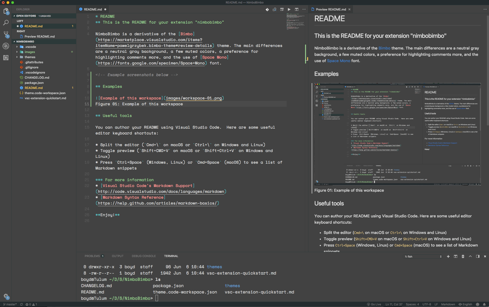

# README
## This is the README for your extension "nimbobimbo"

NimboBimbo is a derivative of the [Bimbo](https://marketplace.visualstudio.com/items?itemName=pawelgrzybek.bimbo-theme#review-details) theme. The main differences are a neutral gray background, a few muted colors, a preference for highlighting comments more, and the use of [Space Mono](https://fonts.google.com/specimen/Space+Mono) font.

<!-- Example screenshots below -->

## Examples

   
Figure 01: Example of this workspace

## Useful tools

You can author your README using Visual Studio Code.  Here are some useful editor keyboard shortcuts:

* Split the editor (`Cmd+\` on macOS or `Ctrl+\` on Windows and Linux)
* Toggle preview (`Shift+CMD+V` on macOS or `Shift+Ctrl+V` on Windows and Linux)
* Press `Ctrl+Space` (Windows, Linux) or `Cmd+Space` (macOS) to see a list of Markdown snippets

### For more information
* [Visual Studio Code's Markdown Support](http://code.visualstudio.com/docs/languages/markdown)
* [Markdown Syntax Reference](https://help.github.com/articles/markdown-basics/)

**Enjoy!**
